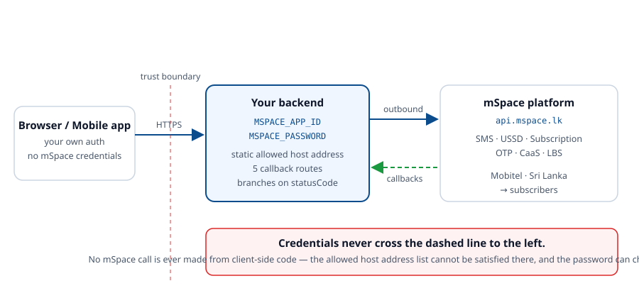

<p align="center">
  
</p>

<h1 align="center">mSpace Skill for Agents</h1>

<p align="center">
  <em>Telco integrations your AI agent gets right the first time.</em>
</p>

<p align="center">
  <sub>by <strong>hSenid Mobile Solutions</strong> for <strong>mSpace</strong></sub>
</p>

<p align="center">
  <a href="https://github.com/hSenidMobileCPaaS/mSpace-as-a-skill/actions/workflows/ci.yml"></a>
  <a href="LICENSE"></a>
  
  
  
  
  
</p>

<p align="center">
  <strong>SMS · USSD · Subscription · OTP · CaaS charging · LBS</strong><br>
  <sub>Mobitel's Sri Lankan application platform — the Inzpire API track.</sub>
</p>

---

Ask an AI agent to integrate mSpace today and it will confidently write
`if (response.ok) return "sent"`. mSpace returns **HTTP 200 for failures**, so that line reports
every error as a success.

Then it will write `if (statusCode === "S1000")` — and break charging, because a successful mSpace
charge request answers **`P1003`**, not `S1000`. It will read `statusDetail` on the one endpoint
that returns `statusDescription`. It will treat `POST /caas/direct/debit` as *the* charge, when it
only sends an OTP and the money moves on a second call. And if you let it near a retry, it will
re-roll `externalTrxId` after a timeout and charge someone twice.

None of that is the model being careless. It is the model not having the contract.

This repo gives it the contract: every endpoint, every parameter, every response field, every
published status code, all five callbacks, and the handful of rules that separate a working
integration from a suspended one.

**In whatever language you already use.** mSpace is JSON over HTTPS, so nothing here is tied to one
runtime:

- [**Every endpoint as a runnable curl**](references/14-curl-reference.md) — the request, every
  parameter defined, the response, every response field explained, and the same for every callback.
  Translate it into the HTTP client you already use and you have the call. No SDK, no generated
  code, no language second-class.
- [**references/12-any-stack.md**](references/12-any-stack.md) specifies the integration around the
  calls language-neutrally — seven components, per-language notes, and an acceptance checklist —
  for Ruby, Rust, Kotlin, Elixir or anything else.
- [**templates/**](templates/README.md) shows the whole thing already built in TypeScript/Node,
  Python, Java, Go, PHP and C# — worked examples to read for shape, not output to paste.

There is deliberately **no code generator**. An emitter serves the languages someone wrote emitters
for and ages with each of their idioms; a curl is the same call everywhere and stays true as long
as the contract does.

---

## Install

Pick your agent. Everything below is the same content behind a different filename.

<details open>
<summary><strong>Claude Code</strong></summary>

```
/plugin marketplace add hSenidMobileCPaaS/mSpace-as-a-skill
```
```
/plugin install mspace@mspace
```

Or clone it as a skill directly:

```bash
git clone https://github.com/hSenidMobileCPaaS/mSpace-as-a-skill ~/.claude/skills/mspace
```
</details>

<details>
<summary><strong>Cursor</strong></summary>

```bash
git clone https://github.com/hSenidMobileCPaaS/mSpace-as-a-skill .mspace
cp .mspace/.cursor/rules/mspace.mdc .cursor/rules/
```
</details>

<details>
<summary><strong>Codex</strong></summary>

```bash
codex plugin marketplace add hSenidMobileCPaaS/mSpace-as-a-skill
codex plugin add mspace@mspace
```
</details>

<details>
<summary><strong>GitHub Copilot</strong></summary>

CLI:

```bash
copilot plugin marketplace add hSenidMobileCPaaS/mSpace-as-a-skill
```

Editor extension — copy the instructions file:

```bash
cp .mspace/.github/copilot-instructions.md .github/
```
</details>

<details>
<summary><strong>Gemini CLI / Antigravity</strong></summary>

```bash
gemini extensions install https://github.com/hSenidMobileCPaaS/mSpace-as-a-skill
```
</details>

<details>
<summary><strong>Windsurf · Cline · Kiro · Qoder</strong></summary>

```bash
git clone https://github.com/hSenidMobileCPaaS/mSpace-as-a-skill .mspace
cp .mspace/.windsurf/rules/mspace.md  .windsurf/rules/     # Windsurf
cp .mspace/.clinerules/mspace.md      .clinerules/         # Cline
cp .mspace/.kiro/steering/mspace.md   .kiro/steering/      # Kiro
cp .mspace/.qoder/rules/mspace.md     .qoder/rules/        # Qoder
```
</details>

<details>
<summary><strong>Aider · Zed · Amp · Jules · Junie · OpenCode · anything reading AGENTS.md</strong></summary>

```bash
git clone https://github.com/hSenidMobileCPaaS/mSpace-as-a-skill .mspace
```

Then reference `.mspace/AGENTS.md` from your own `AGENTS.md`, or copy it to the project root.
</details>

<details>
<summary><strong>No install — any assistant</strong></summary>

Paste the raw URL and ask it to read the file:

```
https://raw.githubusercontent.com/hSenidMobileCPaaS/mSpace-as-a-skill/main/AGENTS.md
```
</details>

Full matrix of what each agent reads: **[docs/agent-support.md](docs/agent-support.md)**.

---

## The part that makes it precise

Documentation alone still leaves an agent recalling parameter names from memory. So the whole
mSpace contract also ships as **structured data** — [`catalog/mspace-api.json`](catalog/mspace-api.json) —
with a zero-dependency CLI over it that any agent can drive through its shell.

This is the capability an MCP server would give you, without running a server: no install, no
dependencies, no process to keep alive, and it works in every agent that can run a command.

```bash
$ node tools/mspace.mjs show subscription-query-base

Query Base (subscriber base size)  (subscription-query-base)
Return the number of subscribers currently registered to the application.

  Endpoint  POST https://api.mspace.lk/subscription/query-base
  Variable  MSPACE_SUBSCRIPTION_QUERY_BASE_URL

  Request parameters
    applicationId   string   required
      Identifies the application. A unique identifier generated while provisioning.
    password        string   required
      Authenticates the application-originated message against the credentials of
      the service provider.

  Response fields
    baseSize        Number of registered users. Arrives as a string — coerce it
                    before arithmetic.
    ...
```

| Command | Answers |
|---|---|
| `list [category]` | What services exist? |
| `show <id>` | What exactly does this call take and return? |
| `search "<query>"` | Which service does the thing I want? |
| `curl <id> [k=v]` | **Give me the call** — a runnable request, with the parameters and the response defined. |
| `validate <id> '<json>'` | Is this payload correct? |
| `code <statusCode>` | What does this code mean, and what do I do? |
| `diagnose "<symptom>"` | Why is this not working? |
| `practices [severity]` | What must I not get wrong? |
| `checklist` | Am I ready for production? |
| `reference <doc>` | Show me the full guide. |
| `platform` | Base URL, tracks, operator, conventions. |

Add `--json` to any command for machine-readable output. Agents that cannot run commands — or
machines without Node — read the catalog JSON directly; same data, and `jq` or a one-line Python
snippet gets at it. The CLI is a documentation reader: it makes no network calls, never sees a
credential, and puts no constraint on the language your integration is written in.

It catches the real mistakes, not just missing fields:

```bash
$ node tools/mspace.mjs validate sms-send '{"message":"hi","destinationAddresses":"tel:94702725777"}'

  ✗ 4 error(s)  against sms-send
    ✗ Missing required field "version" — API version, numbered 1.0, 2.0 and so on…
    ✗ Missing required field "applicationId" — Identifies the application…
    ✗ Missing required field "password" — Authenticates the application-originated message…
    ✗ "destinationAddresses" must be an ARRAY, got string. This is the most common
      mSpace integration bug.
```

And it tells you which code means success on which call:

```bash
$ node tools/mspace.mjs code P1003

  P1003  pending
  Successfully sent OTP to user.

  Retry   no
  Action  This is the success code for CaaS OTP generation — nothing has been charged
          yet. Store requestCorrelator, collect the OTP from the subscriber, and call
          CaaS OTP Verification.
  Success  This is the documented success outcome for: caas-otp-generation
```

### Every endpoint as curl — the path for any language

No SDK, no code generation, no Node: [references/14-curl-reference.md](references/14-curl-reference.md)
writes out all 14 endpoints and all 4 published callbacks at the wire — the request, every
parameter defined, the response, every response field explained, and the status codes that endpoint
can return.

```bash
curl -sS -X POST "$MSPACE_CAAS_DEBIT_URL" \
  -H 'Content-Type: application/json;charset=utf-8' \
  --max-time 15 \
  -d @- <<REQUEST
{
  "applicationId": "$MSPACE_APP_ID",
  "password": "$MSPACE_PASSWORD",
  "externalTrxId": "256091232",
  "subscriberId": "tel:94702725777",
  "paymentInstrumentName": "Mobile Account",
  "amount": "5.00",
  "currency": "LKR"
}
REQUEST
```

| `externalTrxId` | **Required** | Your transaction ID, generated to map the request to the response. Persist it BEFORE calling — it is the idempotency key. |
|---|---|---|
| `paymentInstrumentName` | **Required** | The name of the payment instrument. Value: `Mobile Account`. |
| `amount` | **Required** | Amount to be reserved for charging, sent as a string. Hold it as a decimal type in your own code. |

Credentials come from the environment, so nothing on the page is a secret and nothing you copy can
commit one. The document is generated from the catalog and CI fails if it drifts, so a Ruby, Rust,
Kotlin or Elixir integration works from exactly the same contract as a TypeScript one — and running
a call by hand is the fastest way to tell a bad payload from bad code.

### Why there is no code generator

A generator encodes *idiom*, not contract: the mSpace contract barely moves, but framework
versions, HTTP-client conventions and language idioms move constantly, so the emitter would carry
most of the maintenance while the contract carries most of the value. It also draws an arbitrary
line — the seventh language is a second-class citizen forever.

The curl reference has neither problem. It is generated from the catalog, verified in CI, and
equally correct for Kotlin, Elixir and Rust as for TypeScript. Modern coding agents write better
client code from a precise contract and a set of rules than any template can, because they write in
the host project's actual conventions.

What is kept current instead: the catalog, the curl reference, the status-code semantics, the
practices, and the diagnostics.

And it turns a symptom into a fix:

```bash
$ node tools/mspace.mjs diagnose "every charge fails but the user gets an OTP"

  Likely cause
  CaaS charging on mSpace is two calls, not one. POST /caas/direct/debit only generates
  an OTP and answers P1003; the money moves when the subscriber's OTP is verified with
  POST /caas/otp/verify, and the final outcome arrives on the charging notification.

  Fix
  Treat P1003 as success for the generation step, store requestCorrelator, collect the
  OTP, then call CaaS OTP Verification with referenceNo = requestCorrelator. Settle the
  transaction from the charging notification. See references/06-caas.md.
```

---

## Configuration is two credentials and your enabled endpoints

An mSpace application can only call the APIs it was provisioned for, so the configuration mirrors
that exactly — nothing else is environment-dependent:

```bash
MSPACE_APP_ID=APP_XXXXXX
MSPACE_PASSWORD=replace-me

# Uncomment only what is enabled on your application:
#MSPACE_SMS_SEND_URL=https://api.mspace.lk/sms/send
#MSPACE_SUBSCRIPTION_SEND_URL=https://api.mspace.lk/subscription/send
#MSPACE_CAAS_DEBIT_URL=https://api.mspace.lk/caas/direct/debit
#MSPACE_CAAS_OTP_VERIFY_URL=https://api.mspace.lk/caas/otp/verify
```

An unset endpoint is meaningful: the client refuses the call locally, so you get a clear error
naming the missing variable instead of `E1309` from the platform after a round trip. Pointing one
at the mSpace simulator from the developer bundle is the whole local-development switch.

Timeouts, encodings and retry policy are **not** configuration — they are constants in the client,
because they are properties of the protocol rather than of your deployment.

These variable names are identical across every language template, so a polyglot estate has one
deployment story.

## Architecture it steers agents toward

<p align="center">
  
</p>

---

## Coverage

All six APIs mSpace publishes on its [Inzpire services page](https://mspace.lk/serviceInzpire.html),
one reference document each:

| Inzpire API | Operations | Reference |
|---|---|---|
| **SMS API** | Send (MT), send to the subscribed base (`tel:all`), receive (MO), delivery status reports | [02-sms](references/02-sms.md) |
| **USSD API** | Send screens, receive input, the `mo-init`/`mo-cont`/`mt-init`/`mt-cont`/`mt-fin` state machine | [03-ussd](references/03-ussd.md) |
| **Subscription API** | Register (opt-in), **unregister (opt-out)**, subscriber status, **query base size**, subscriber charging info (up to 10 at a time), paged subscriber list, subscriber notifications | [04-subscription](references/04-subscription.md) |
| **OTP API** | Request, verify, masked-MSISDN handoff — activating a subscription from a web or app sign-up | [05-otp](references/05-otp.md) |
| **CaaS API** | The three-step OTP-authorised charge: generation (`P1003`), verification (the money moves), charging notification (settlement) | [06-caas](references/06-caas.md) |
| **LBS API** | Request a subscriber's location, with `requesterId` and `subscriberId` as separate fields | [07-lbs](references/07-lbs.md) |
| **Not published** | Voice/IVR, and the balance retrieval the CaaS blurb mentions — documented as absent, with no invented endpoints | [06-caas](references/06-caas.md) |

The **Xpand** track — no-code Contact, Vote, Alert and Scheduled Messages applications — is
described so an agent can tell a user when a template beats an integration.

### Languages

| Stack | What ships |
|---|---|
| TypeScript / Node | config, client, types, Next.js callback routes, USSD session store |
| Python | config, client, FastAPI callbacks, USSD session store (standard library only) |
| Java | config, client, Spring callback controller |
| Go | config, client, `net/http` callbacks (standard library only) |
| PHP | config, client, framework-neutral callbacks with Laravel notes |
| C# / .NET | options, typed client, ASP.NET Core callbacks + background worker |
| Anything else | [references/14-curl-reference.md](references/14-curl-reference.md) — every endpoint as curl, with definitions — plus [references/12-any-stack.md](references/12-any-stack.md) for the seven components, per-language notes and an acceptance checklist |

Plus the complete published status-code table, every callback contract, and the operational
practices that keep an application approved.

### Skills

| Skill | Use it for |
|---|---|
| `mspace` | General mSpace work; the rules and the service map |
| `mspace-scaffold` | Starting a new integration |
| `mspace-callbacks` | Inbound webhooks |
| `mspace-review` | Auditing existing code |
| `mspace-debug` | A failing call or callback |
| `mspace-golive` | The pre-production checklist |
| `mspace-help` | Quick reference |

On plugin-tier hosts these are also slash commands: `/mspace`, `/mspace-review`, and so on.

---

## What it actually changes

Fourteen mistakes agents make on this platform, and what each one costs:

| Mistake | Consequence |
|---|---|
| Deciding on the HTTP status (`res.ok`, `raise_for_status()`, `EnsureSuccessStatusCode()`) | mSpace returns **HTTP 200 for errors**. Every failure reported as a success. |
| `statusCode === "S1000"` as the only success | Every successful charge request (**`P1003`**) reported as a failure, and an empty subscriber base (**`S1001`**) as a broken integration. |
| Reading only `statusDetail` | CaaS OTP verification returns `statusDescription`. The one call that took someone's money is the one with no message. |
| Treating `/caas/direct/debit` as the charge | It only sends an OTP. Nothing is charged until `/caas/otp/verify`, and nothing is settled until the notification. |
| `externalTrxId` sent as `referenceNo` on verification | `E1855` on every confirmation. It wants the `requestCorrelator`. |
| Charge retried with a fresh `externalTrxId` | **Can charge a real person twice.** |
| `destinationAddresses: "tel:94…"` | It is always an **array**. Sends fail. |
| `version` omitted on SMS Send or USSD Send | Mandatory on both. |
| Subscription status treated as two-valued | Six statuses. `INITIAL`, `REG_PENDING` and `TEMPORARY_BLOCKED` are live subscribers in trouble, not absent ones. |
| Hardcoded `applicationId` / `password` | A credential that can charge your subscribers, committed to git. |
| LBS `requesterId` and `subscriberId` swapped | Locates the wrong person. |
| Self-generated USSD `sessionId` | Sessions orphan; the subscriber's screen goes blank. |
| USSD sessions in an in-process map, whatever the language | Works in dev, breaks the moment you scale. |
| Work before acknowledging a callback | Sessions time out, duplicates pile up, and an unparseable response comes back as `E1607`. |
| TLS verification switched off (`rejectUnauthorized: false`, `verify=False`, `InsecureSkipVerify`, …) | Your credentials become interceptable. |

---

## Quick start

```bash
# 1. Configure
cp templates/.env.example .env
$EDITOR .env                       # credentials, then uncomment ONLY the endpoints
                                   # for the APIs enabled on your application

# 2. Confirm the egress IP of the server that will call mSpace is listed under
#    Allowed Host Address on the application record — determine it ON THAT SERVER

# 3. Verify connectivity and credentials
./scripts/smoke-test.sh            # Windows: .\scripts\smoke-test.ps1

# 4. Test your callback handlers — no mSpace account needed
./scripts/test-callbacks.sh http://localhost:3000
```

No account yet? The mSpace developer bundle ships a **local simulator** — extract it, run
`sdp-simulator.bat console` (or `sh sdp-simulator console`), open `http://localhost:10001/`, and
point your `MSPACE_*_URL` variables at it. Needs Java 1.6.0 or above.

Then ask your agent:

> Add mSpace subscription and SMS to this app — subscribers opt in by SMS keyword, get a welcome
> message, and can text STOP to unsubscribe.

Starting from nothing, mid-build, or bolting mSpace onto an app that already has users? The A-to-Z
route for each is [references/13-implementation-playbook.md](references/13-implementation-playbook.md).

---

## What's inside

```
SKILL.md · AGENTS.md              Entry points (Claude Code / everyone else)
catalog/mspace-api.json           The whole contract as structured data
tools/mspace.mjs                  Offline CLI over the catalog
references/                       14 guides: one per Inzpire API (SMS, USSD, Subscription, OTP,
                                  CaaS, LBS), then callbacks, codes, security, go-live, the
                                  language-neutral spec, the A-to-Z playbook, and every endpoint
                                  as curl with its definitions
templates/                        .env.example + working config, client and callback handlers
                                  in TypeScript/Node, Python, Java, Go, PHP and C#
skills/ · commands/               7 task skills and their slash commands
scripts/                          Smoke tests (bash + PowerShell), callback tests, rule sync,
                                  curl-reference build
docs/agent-support.md             Which agent reads which file
```

---

## Development

```bash
npm test                                     # catalog + tooling tests
npm run check                                # tests + everything generated is in sync
node scripts/sync-rules.mjs                  # regenerate the agent rule copies
node scripts/build-curl-reference.mjs        # regenerate the curl reference
```

Two things are generated and CI fails if they drift: the seven agent rule files, from `AGENTS.md`,
and `references/14-curl-reference.md`, from `catalog/mspace-api.json`. The test suite verifies that
every referenced status code exists, every parameter is fully specified, every documented sample
validates against its own schema, every endpoint and parameter appears in the curl reference, and
no credential-shaped string is committed.

See [CONTRIBUTING.md](CONTRIBUTING.md). Corrections to the API contract are the most valuable
contribution — cite the documentation page or paste the observed response.

---

## Sources

Everything derives from the official mSpace documentation:

- <https://mspace.lk/API_Documentation/mobitel_tap_api.html> — the API reference
- <https://mspace.lk/API_Documentation/openapi.json> — the machine-readable specification
- <https://mspace.lk/serviceInzpire.html> · <https://mspace.lk/serviceXpand.html> — the two tracks
- <https://mspace.lk/inzpire_tutorial.html> — application provisioning
- <https://mspace.lk/prerequisite.html> · <https://mspace.lk/simulator_tutorial.html> — the
  developer bundle and simulator

**Nothing in this repo is invented.** Where mSpace publishes no status-code table for an endpoint,
this skill says so rather than borrowing a neighbouring endpoint's. Where the documentation gives a
code two meanings — `E1856` and `E1857` both do — both are recorded, with the endpoint each applies
to. Where a schema exists with no endpoint path (`queryBalance`), that is stated as unavailable
rather than turned into a URL.

mSpace evolves. Confirm with the platform what your application is actually provisioned for before
go-live, and open an issue if the behaviour moves.

## Support

- **Platform** — <https://mspace.lk>
- **Operator** — <https://www.mobitel.lk/mspace>

Quote your `requestId` / `externalTrxId` / `internalTrxId` / `sessionId` and the `statusCode` —
that is what a trace is built from.

## Security

No secrets in this repo; every credential is a placeholder and CI enforces it. The CLI makes no
network calls and never reads your credentials. See [SECURITY.md](SECURITY.md), and read
`scripts/smoke-test.*` before running it — `--with-charge` starts a real charge.

## Licence

**Proprietary.** Copyright © 2026 hSenid Mobile Solutions (Pvt) Ltd. All rights reserved.

This skill is the sole property of hSenid Mobile Solutions and is licensed for **use only**. See
[LICENSE](LICENSE) for the full terms.

| | |
|---|---|
| ✅ You may | Install it into your AI coding assistant and use it, unmodified, to build and operate your own mSpace integrations. The integration code you produce is yours. |
| ❌ You may not | Copy it beyond what installation requires, modify it, publish or redistribute it, mirror or fork it, sublicense it, sell it, or bundle it into anything you sell. |

**mSpace**, **Inzpire**, **Xpand**, **Mobitel**, **hSenid Mobile** and their logos are trademarks
of their respective owners. You may refer to mSpace by name when describing an integration you have
built; you may not use the marks in your own product, service or marketing.

For any permission beyond this — including modifying, redistributing or embedding the skill —
contact hSenid Mobile Solutions.

---

<p align="center">
  <a href="https://www.hsenidmobile.com">
    
  </a>
</p>

<p align="center">
  <sub>Built by <a href="https://www.hsenidmobile.com">hSenid Mobile Solutions</a> for
  <a href="https://mspace.lk">mSpace</a>.</sub><br>
  <sub>The platform evolves — verify anything security- or billing-critical against
  <a href="https://mspace.lk/API_Documentation/mobitel_tap_api.html">the mSpace API documentation</a>
  before going live.</sub>
</p>
